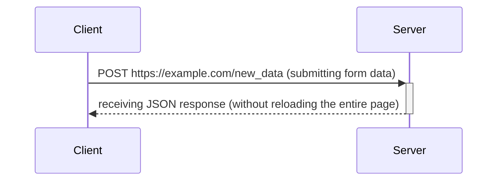

```mermaid
sequenceDiagram
    

    Client->>+Server: POST https://example.com/new_data (submitting form data)
    
    Server-->>-Client: receiving JSON response (without reloading the entire page)

   
```
